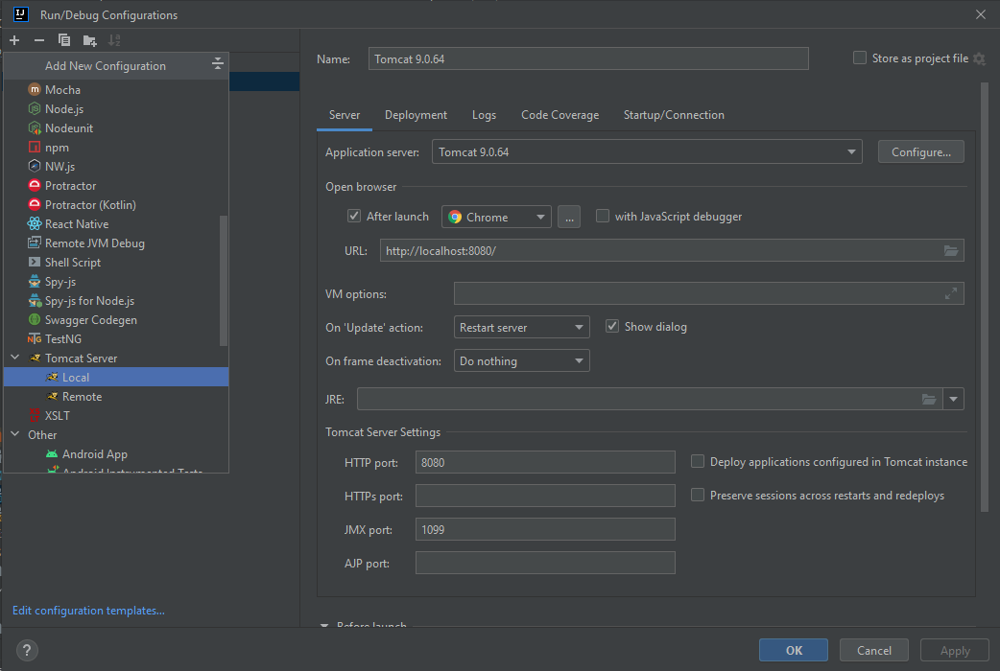
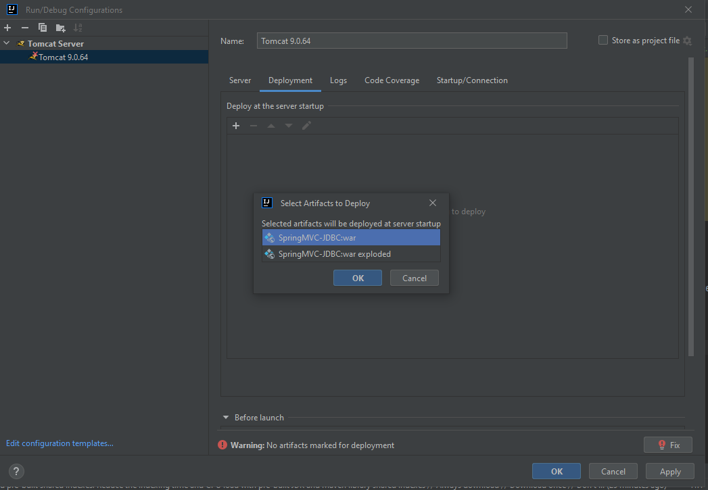
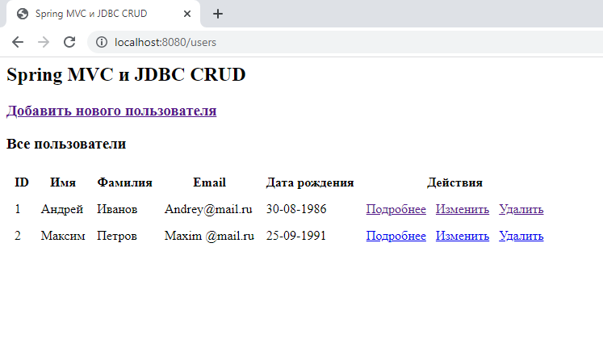
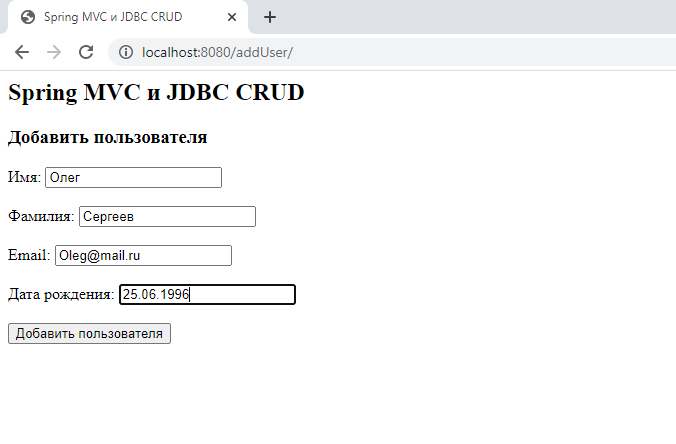
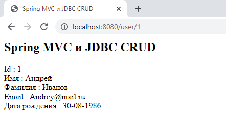
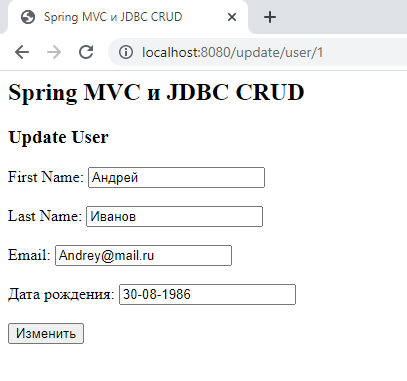
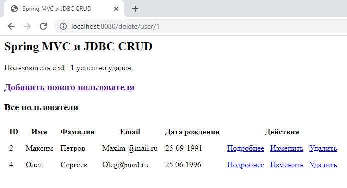

# Spring MVC - JDBC

## Описание

CRUD Spring MVC приложение для взаимодействия с объектами в БД при помощи JDBC.

Возможности и опции:

1. Вывод на экран списка всех работников, находящихся в определенной таблице в БД
2. Удаление работника
3. Добавление нового работника
4. Изменение информации о работнике

## Инструкция по запуску приложения:

1. Подготовить БД и таблицу
```sql
CREATE DATABASE spring_mvc_jdbc;
USE spring_mvc_jdbc;    

CREATE TABLE `user_detail`
(
    `id`         int(10) NOT NULL AUTO_INCREMENT,
    `first_name` varchar(20)  NOT NULL,
    `last_name`  varchar(15)  NOT NULL,
    `email`      varchar(100) NOT NULL,
    `dob`        varchar(16)  NOT NULL,
    PRIMARY KEY (`id`)
);

insert into `user_detail`(`id`, `first_name`, `last_name`, `email`, `dob`)
values (1, 'Андрей', 'Иванов', 'Andrey@mail.ru', '30-08-1986'),
       (2, 'Максим ', 'Петров', 'Maxim @mail.ru', '25-09-1991');
```
2. Клонировать репозиторий: `https://github.com/M-Magomedov/Spring-MVC-JDBC.git`
3. Настроить Apache Tomcat
   В Intellij Idea нажимаем на Edit Configuration рядом с кнопкой запуска, выбираем Tomcat Server -> Local, в появившемся окне нажимаем Configure и находим архив tomcat (скачиваем при необходимости)
   
   Переходим в Deployment, добавляем артефакт
   
   Нажимаем Apply, OK. Сервер готов
4. Запустить приложение на локальном сервере и перейти по адресу http://localhost:8080/spring-mvc-jdbc/users

## Все пользователи



## Добавить нового пользователя



## Подробная информация о пользователе



## Изменить пользователя



## Удалить пользователя




