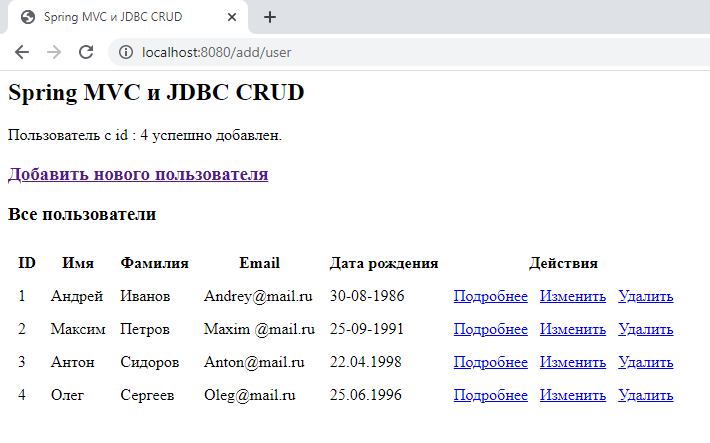

# Spring MVC - JDBC

## Инструкция по запуску приложения:
1. Клонировать репозиторий: `git clone https://github.com/hendisantika/spring-mvc-jdbc.git`
2. Перейти в папку: `cd spring-mvc-jdbc`
3. Запустить приложение: `mvn clean package tomcat9:run`
4. Откройте свой любимый браузер: http://localhost:8080/spring-mvc-jdbc/users

## Скриншоты

## Добавить нового пользователя

## Все пользователи

## Подробная информация о пользователе

## Изменить пользователя

## Удалить пользователя

